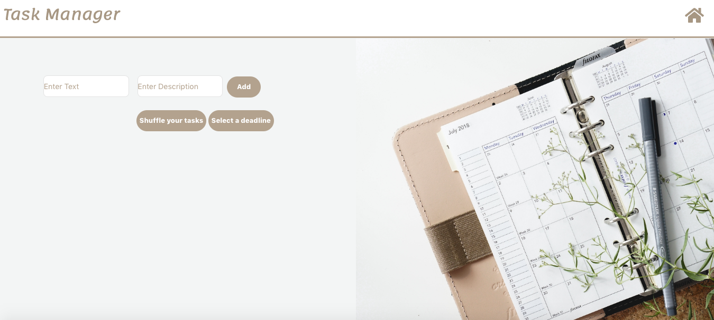
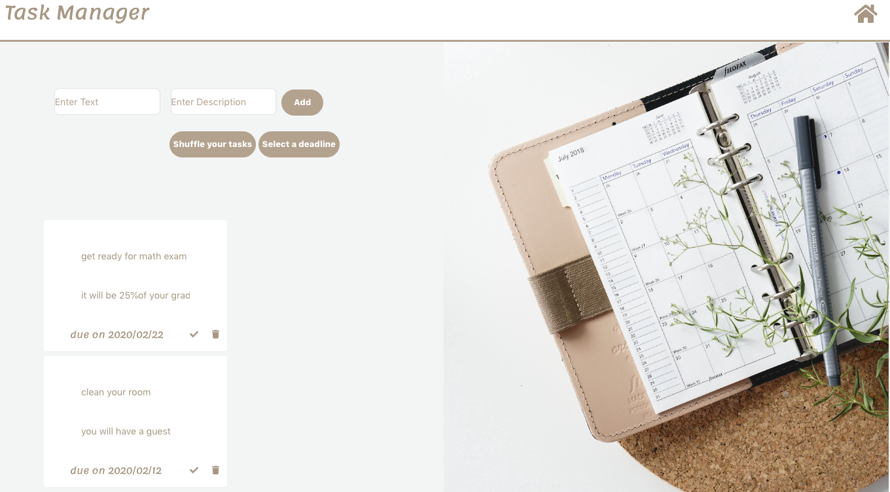

Simple Task Manager : you can visit it https://vigorous-kilby-c20200.netlify.com/

The technologies used for this project is JavaScript, React.

Our homepage, just click start and start to punch today.

Here you can add a task with its description and due date. 

You can edit your task by clicking on them, you can click complete and delete your tasks. Shuffle button lets you change the order of your tasks, so that you can see if you are missing anything.
